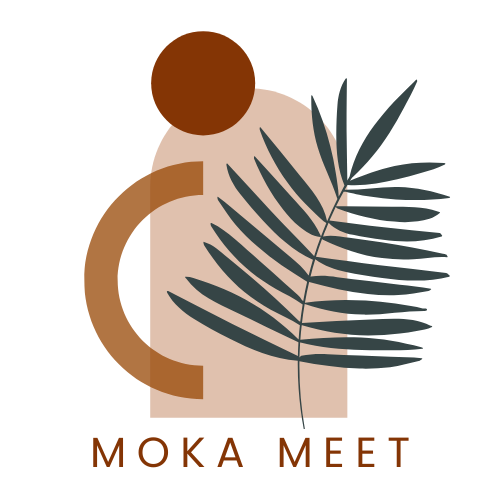

# Moka Meet ☕  
*A social media app for coffee lovers.*

## 📌 About the App  
Moka Meet is a web application designed for coffee enthusiasts to connect over their shared love for cafes and coffee shops. Users can add, review, and browse coffee shops, view other user profiles, send messages, and maintain a wishlist of favorite spots.  

The idea for Moka Meet came from my own experiences socializing at coffee shops—I wanted a way to bring that sense of community online.  

## 🚀 Getting Started  
### 🔗 https://moka-meet-08734d80619f.herokuapp.com/

### 📋 Planning Materials  
[Trello Board](https://trello.com/invite/b/67d127a026db9c3d63ca1fc8/ATTIdf6bb4db996ee046ceafdd916234ac62B0175704/project-2-tracker)  
*(Wireframes will be added soon.)*  

## 🔧 Features  
✅ **MVP (Minimum Viable Product)**  
- User authentication (sign up, log in, log out)  
- Profile page displaying rated coffee shops and wishlist  
- Add and review coffee shops (user-driven database)  
- Search and browse the database of coffee shops  
- Edit/delete coffee shop info, reviews, and lists  

🚀 **Stretch Goals (Future Enhancements)**  
- Filtering/search view for coffee shops  
- Compare common coffee shops with friends  
- Coffee shop recommendations based on friends & popular cafes  
- Google Maps API integration  

## 🛠️ Technologies Used  
- **Frontend**: JavaScript, EJS, CSS  
- **Backend**: Node.js, Express.js  
- **Database**: MongoDB, Mongoose  
- **Authentication**: Bcrypt, Passport.js  
- **Hosting**: Heroku 
- **UI Enhancements**: Uiverse.io components  

## 🎨 Attributions  
- **UI Components from Uiverse.io**:  
  - [Spotty Goose](https://uiverse.io/mi-series/spotty-goose-56)  
  - [Terrible Catfish](https://uiverse.io/Madflows/terrible-catfish-72)  
  - [Hot Panther](https://uiverse.io/Tsiangana/hot-panther-73)  
- **Logo Design**: Canva  
- **Assistance with Development**: ChatGPT  

## 📌 User Story  
*"As a coffee lover, I want to find and review coffee shops, connect with other users who share my passion, and maintain a wishlist of places to visit, so that I can build a social network around my favorite cafes."*  

## 🏗️ Next Steps  
- Complete user authentication & authorization  
- Finalize the UI design and wireframes  
- Add interactive map api
- Create algorithim or use api to provide relevant coffee shop suggestions to users 
- Implement additional features from stretch goals

---

💡 *Moka Meet is a work in progress! If you have suggestions or want to contribute, feel free to reach out.* ☕  
